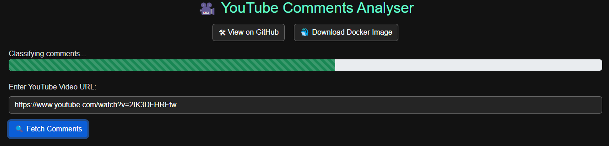
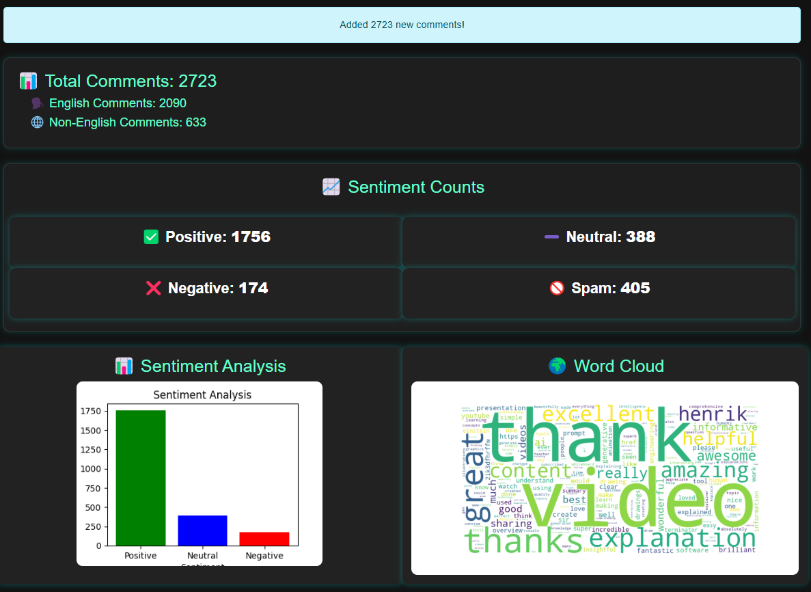
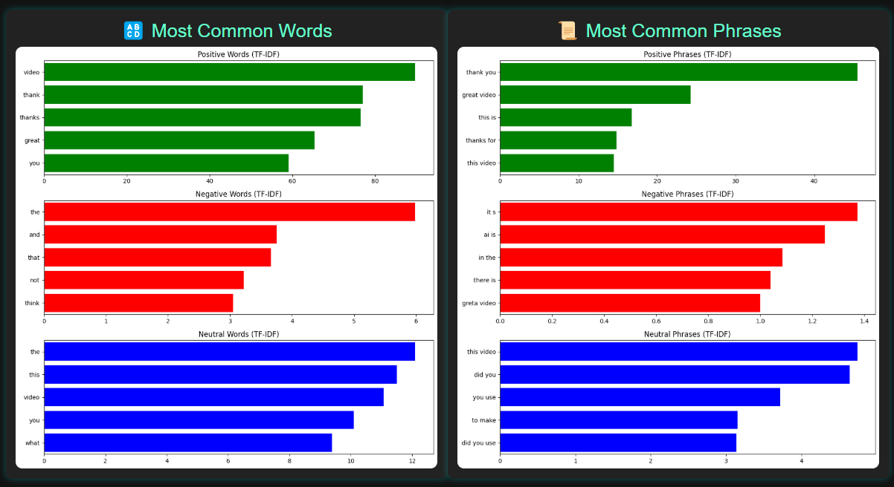

# YouTube Sentiment Analyser

---

**https://youtube-sentiment-analyser.thankfulcoast-599cc73b.westus2.azurecontainerapps.io**

---

YouTube Sentiment Analyser is a web application that analyzes the sentiment of comments on YouTube videos. Users provide a YouTube video URL, and the system processes the comments using pre-trained NLP models to classify sentiment and detect trends.

## **Usage Example**

To analyze the sentiment of YouTube video comments, provide a YouTube Video URL, wait for the system fetch comments from the video, models classify the comments, and the system displays the sentiment trends and visualizations.

### Process of Sentiment Analysis



### Results





## **Key Features**
- **Sentiment Analysis:** Classifies comments as **positive, neutral, or negative**.
- **Spam Detection:** Filters out spam comments.
- **Hate Speech Detection:** Identifies and adjusts for **hate speech** and **offensive content**.
- **Sarcasm Detection:** Modifies sentiment predictions for sarcastic comments.
- **Multilingual Support:** Analyzes **non-English** comments separately.
- **Visualization:** Displays sentiment trends for insights into audience reactions.

## **How It Works**
The system uses five models that work together to classify YouTube comments. These models detect spam, hate speech, sarcasm, and sentiment, applying a weighted approach to determine the final classification. 

For a detailed explanation of how the models make predictions, visit the **models** folder, which contains a full detailed explanation of the decision process.

## **How to Download the Docker Image**

To run the YouTube Sentiment Analyser using Docker, you can choose between two versions:

### **1. Faster GPU Version (Requires CUDA 11.8)**
For users with a compatible GPU and CUDA 11.8, this version runs faster:

```sh
docker pull davydantoniuk/youtube-sentiment-analyser:cuda11.8
```

### **2. Lightweight CPU Version (No GPU Required)**

For systems without a GPU, this version runs on the CPU:

```sh
docker pull davydantoniuk/youtube-sentiment-analyser:cpu
```

More details, including instructions on setting up an API key, can be found on [Docker Hub](https://hub.docker.com/r/davydantoniuk/youtube-sentiment-analyser) repository.